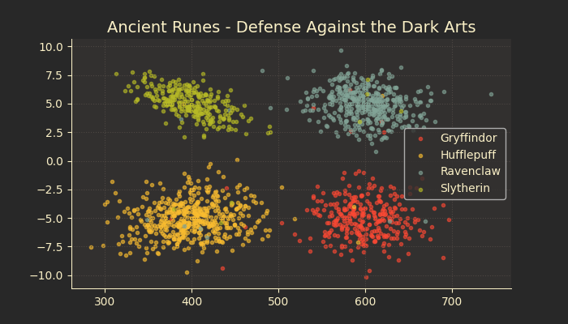
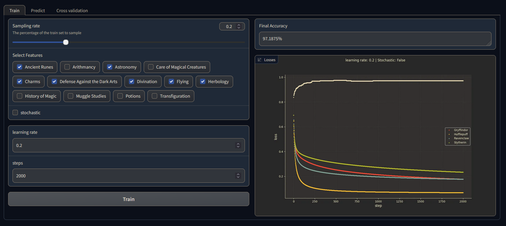

I am Pierre Lagache, and I am passionate about creating simple yet elegant solutions to projects.  
Scroll through to discover my journey and the stories behind each one.  
Please feel free to [contact](#contact-and-informations) me.

---

## Machine Learning
- [Data Science X Logistic Regression](#data-science-x-logistic-regression)
- [Linear Regression](#linear-regression)

## System & network
- [Inception](#inception-of-things)
- [Ping](#ping)

---

## Data Science X Logistic Regression

The term DataScience in the title will be clearly considered by some to be abusive. That is true. The subject is vast.  
In [DSLR](https://github.com/plagache/DSLR), I had to train a multi-classifier using a logistic regression one-vs-all.

- I had to learn how to read a data set, to visualize it in different ways, to select and clean unnecessary information from the dataset.

- I had to train a logistic regression that will solve classification problem. After that I created an interface to simplify the tweaking of parameters during training.

---

## Inception of Things

This [project](https://github.com/plagache/inception_of_things) is a System Administration related exercise. It consist of setting up several environments under specific rules.  
The whole project has to be done in a virtual machine.

- The first part introduces us to K3s and Vagrant.
- The Second part deepens our knowledge on Ingress.
- The last part makes us discover K3d and Argo CD.

---

## Ping

This [project](https://github.com/plagache/ping) is about recoding the ping command with the C language.  
Ping is the name of a command that allows to test the accessibility of another machine through the IP network. The command measures also the time taken to receive a response, called round-trip time.

- I had to learn about various internet protocole such has ipv4 and icmp.
- I had to implement the creation, sending of socket.
- I had to implement parsing for different icmp echo responses.
- I had to implement time management to determine the round-trip time.

---

## Linear Regression

This [project](https://github.com/plagache/linear_regression) was an introduction to the basic concept behind machine learning.  
I had to create a program that predicts the price of a car by using a linear function train with a gradient descent algorithm.

---

## Contact and informations

Mobile: [06 87 06 82 82](tel:+33687068282)  
Email: [plagache@protonmail.com](mailto:plagache@protonmail.com)  
Profile github: [https://github.com/plagache](https://github.com/plagache)  
Profile malt: [https://www.malt.fr/profile/pierrelagache1](https://www.malt.fr/profile/pierrelagache1)
