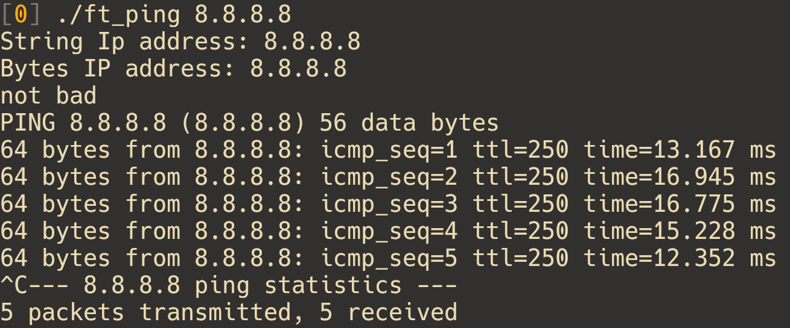
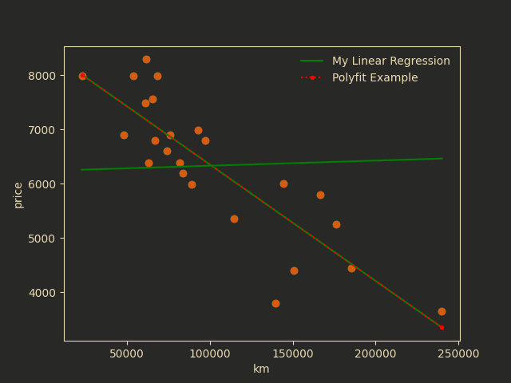

<!---
Remove I learned, for I did
i want show what i know
-->

I am Pierre Lagache, and I am passionate about creating simple yet elegant solutions to projects.  
Scroll through to discover my journey and the stories behind each one.  
Please feel free to [contact](#contact-and-informations) me.

---

## Machine Learning
- [Multilayer perceptron](#multilayer-perceptron)
- [Data Science X Logistic Regression](#data-science-x-logistic-regression)
- [Linear Regression](#linear-regression)

## System & network
- [Inception](#inception-of-things)
- [Ping](#ping)

---

## Multilayer Perceptron

To achieve this [project](https://github.com/plagache/fusion) I wrote a machine learning framework composed of a "Tensor" class that perform automatic calculus of Derivatives.  
The Idea is to leverage the [chain rule](https://en.wikipedia.org/wiki/Chain_rule) to compute the gradient.  
Finally, I will make an "Optimizer" class that will perform differents types of parameters optimization.

---

## Data Science X Logistic Regression

The term Data Science in the title will be clearly considered by some to be extra. That is true. The subject is vast.  
In [DSLR](https://github.com/plagache/DSLR), I trained a multi-classifier(one-vs-all) using a logistic regression.

- I analyzed the dataset, displayed it in different ways, and selected and cleaned unnecessary information.

- I trained a logistic regression that solves classification problems. After that I created an interface to edit parameters for training.

---

## Inception of Things

[Inception of Things](https://github.com/plagache/inception_of_things) is a system administration project designed to set up multiple environments according to specific rules.
The entire codebase is executed within a virtual machine, ensuring isolated and controlled settings.
I also delved into the different types of virtualization available, particularly libvirt, KVM and QEMU.

- I built a virtualized environment with Vagrant and managed its different VMs with K3s.
- I created Ingress rules to control how traffic is directed to different replicas.
- I implemented Continuous Integration and Continuous Deployment using K3d and Argo CD. K3d allowed me to run a lightweight Kubernetes cluster in Docker, while Argo CD automated the deployment of applications

---

## Ping

This [project](https://github.com/plagache/ping) is about recoding the ping command with the C language.  
I chosed to reimplement ping in C, as it allows me to control system resources and handle network operations manually.

- I manipulated various internet protocols such has ipv4 and icmp.
- I implemented the creating and sending of socket.
- I developed the parsing for different icmp echo responses.
- I implemented time management to determine the round-trip time.

---

## Linear Regression

I implemented a [linear regression](https://github.com/plagache/linear_regression) to model the relationship between variables.
The model was trained using the gradient descent algorithm.

- I created a second program that retrieves one variable based on the other.
- I developed a program that generates a GIF of 120 images of the plots during training.

---

## Contact and informations

Mobile: [06 87 06 82 82](tel:+33687068282)  
Email: [plagache@protonmail.com](mailto:plagache@protonmail.com)  
Profile github: [https://github.com/plagache](https://github.com/plagache)  
Profile malt: [https://www.malt.fr/profile/pierrelagache1](https://www.malt.fr/profile/pierrelagache1)
